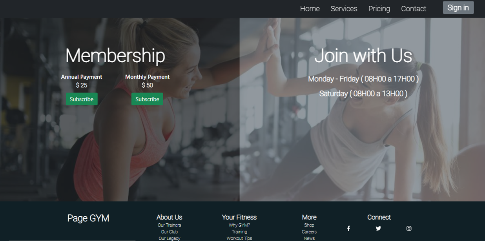
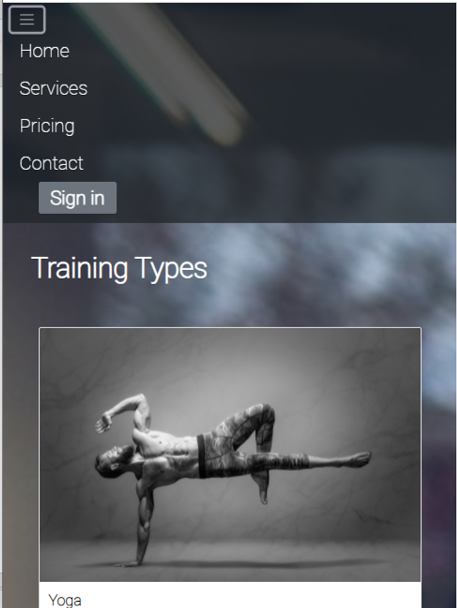
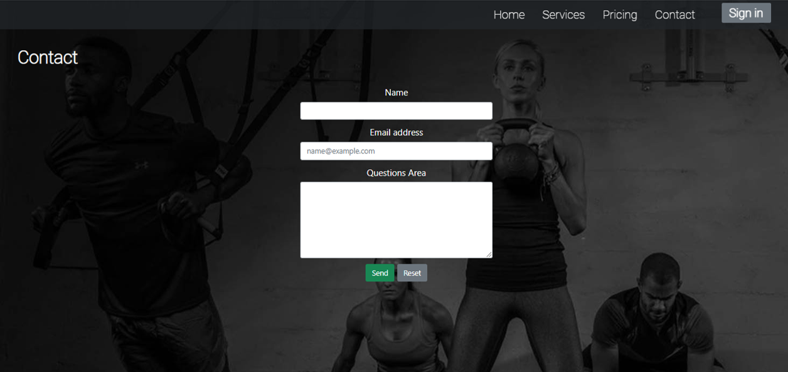

# Gym Page

This is a prototype gym website. 

## Description

HTML, CSS, SASS, Bootstrap and basic knowledge of SEO were used for the creation. The website is responsive for different types of devices.

## Project Screenshots

### Home

### Pricing session

### Services session 

### Contact session

## Project Visualization

Use this link to enter and view the complete project: https://felixmartinezcasadiego.github.io/Page_Gym/